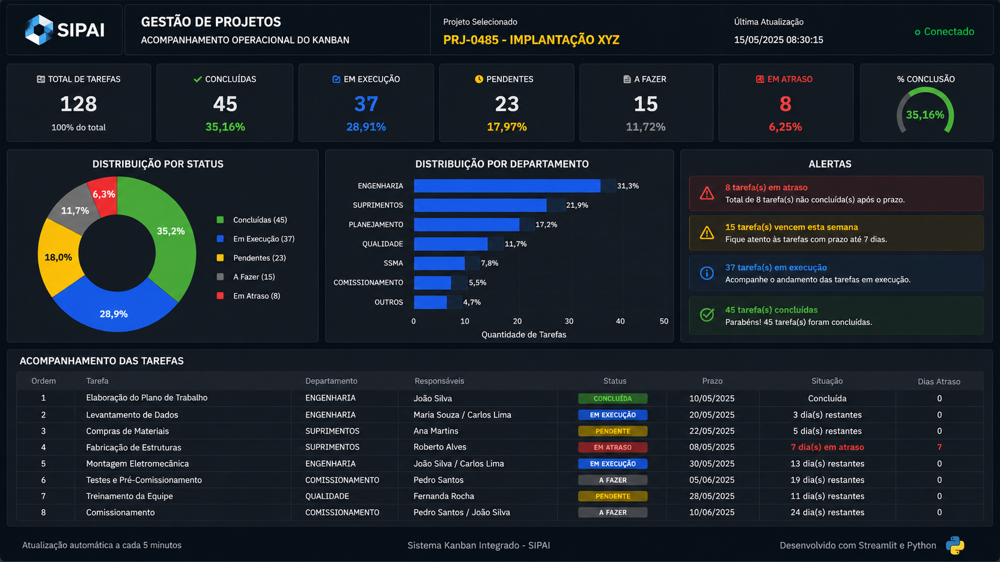

# 📺 Kanban Operacional Dashboard

Dashboard desenvolvido em **Python + Streamlit** para acompanhamento operacional de projetos.



## Funcionalidades

- 📊 Indicadores executivos
- 📈 Gráficos interativos (Plotly)
- 🔄 Rotação automática entre projetos
- 📺 Layout otimizado para TVs
- 🔄 Atualização automática
- 🗄️ Integração com SQL Server

## Tecnologias

- Python
- Streamlit
- Plotly
- Pandas
- SQL Server (pyodbc)

## Estrutura

```text
components/
pages/
utils/
assets/
app.py
config.py
db.py
```
